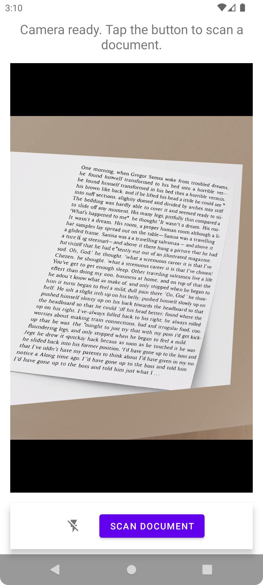
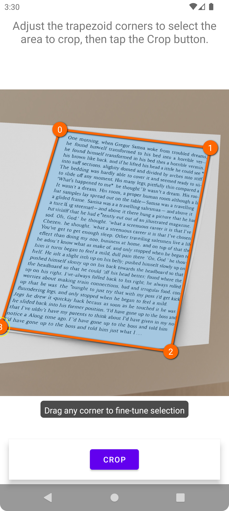
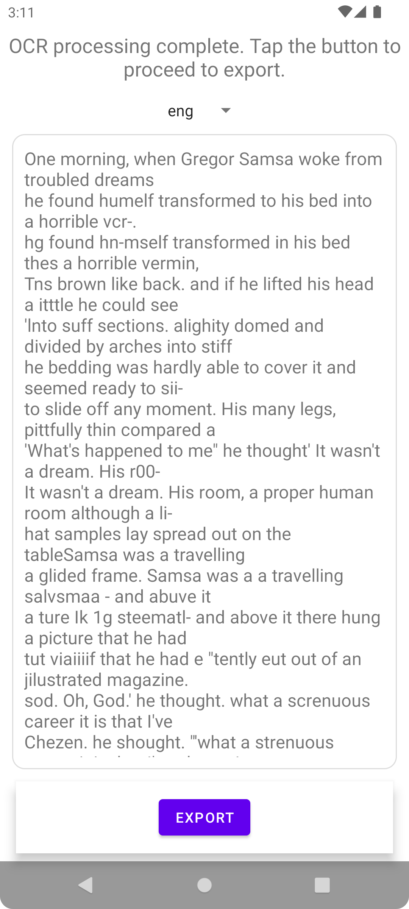
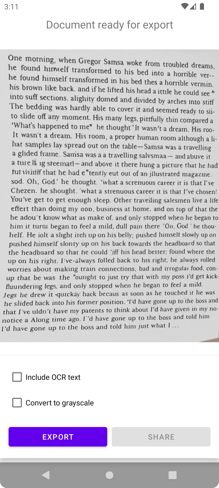

# MakeACopy

MakeACopy is an open-source document scanner app for Android that allows you to digitize paper documents with OCR functionality. The app is designed to be privacy-friendly, working completely offline without any cloud connection or tracking.

[](https://f-droid.org/packages/de.schliweb.makeacopy/)
[](https://play.google.com/store/apps/details?id=de.schliweb.makeacopy)

Or download the latest APK from the [Releases Section](https://github.com/egdels/makeacopy/releases/latest).

[](https://opensource.org/licenses/Apache-2.0)

## APK Verification

All official releases of MakeACopy are signed with one of the following certificates:

- **Upload key** (used for GitHub releases, F-Droid, and sideload APKs)  
  SHA-256: AE:32:2D:3F:B7:1A:FE:21:DF:47:27:E3:7A:5C:68:03:51:1D:5A:2F:E1:FC:31:35:43:0C:EE:06:99:FA:1B:34  

- **Google Play App Signing key** (used for Play Store releases)  
  SHA-256: C0:71:44:39:CB:51:62:32:A4:47:91:7A:6F:C2:28:1E:45:FA:AA:DD:37:F8:30:B1:01:1F:B4:85:68:8E:0D:64  
  
### Verify with apksigner
```bash
apksigner verify --print-certs MakeACopy-vX.Y.Z.apk
```

## Features

- **Camera Scanning**: Capture documents using the device camera
- **Edge Detection**: Automatic document edge detection using OpenCV, enhanced with a machine learning model ([ONNX, from DocAligner](https://github.com/DocsaidLab/DocAligner) – Apache 2.0)
- **Perspective Correction**: Adjust and crop documents with manual or automatic perspective correction
- **Image Enhancement**: Apply filters (grayscale, contrast, sharpening)
- **OCR**: Offline text recognition with Tesseract
- **PDF Export**: Save as searchable PDF with recognized text
- **JPEG Export**: Export scans as high-quality JPEG images (configurable quality, color/BW)
- **Multi-page Scanning**: Combine multiple pages into one document; reorder and manage pages before export
- **Last Scans**: Quickly access and reuse your most recent scans
- **Share & Save**: Export locally or share with other apps
- **Dark Mode**: Material 3 theme with day/night support
- **Privacy-Focused**: 100% offline functionality, no internet connection required

### OCR Languages

MakeACopy supports OCR via Tesseract. You can choose the OCR language during the OCR step.

Supported out of the box:
- English (eng), German (deu), French (fra), Italian (ita), Spanish (spa)

## Screenshots

<p align="center">
  
  
  
  
</p>

## Installation

### F-Droid

MakeACopy is F-Droid compliant. The app builds all required native components from source during CI/local builds:

1. **OpenCV Java Classes**: The required OpenCV Java wrapper classes are directly included in the app's source tree (copied from OpenCV but now part of this project). They are no longer used from the submodule.
2. **OpenCV Native Libraries**: All OpenCV native libraries are built from source using the official OpenCV code provided via the Git submodule at `external/opencv`.
3. **ONNX Runtime Native Libraries**: For ML-assisted edge detection, ONNX Runtime is built from source (CPU-only, Java bindings) using the submodule at `external/onnxruntime` via `scripts/build_onnxruntime_android.sh`. The resulting artifacts are integrated into `app/src/main/jniLibs/<ABI>/` (e.g., `libonnxruntime.so`, `libonnxruntime4j_jni.so`) and `app/libs/` (`onnxruntime-*.jar`).

This approach ensures F-Droid compatibility by not including any pre-compiled binaries in the repository and building OpenCV and ONNX Runtime native components from source.

### GitHub Releases

You can download the latest APK from the [Releases](https://github.com/egdels/makeacopy/releases) page.

#### Automated Builds

All automated builds are handled by a single GitHub Actions workflow:

- Workflow: .github/workflows/build-release.yml
- Triggers: on push to main, pull_request to main, and tags starting with v*

What the workflow does on every run (aligned with CI):
- Sets up JDK 17 (Temurin) and installs Android NDK 28.0.13004108
- Pins CMake 3.31.6 and Python 3.11.2 for deterministic native builds
- Checks out submodules (external/opencv and external/onnxruntime)
- Builds OpenCV native libraries from source via scripts/build_opencv_android.sh
- Collects reproducibility evidence for native builds (scripts/collect_repro_evidence.sh)
- Integrates OpenCV artifacts into the app via scripts/prepare_opencv.sh
- Builds ONNX Runtime for Android (CPU-only, Java bindings) via scripts/build_onnxruntime_android.sh
- Builds the Android app with Gradle (AAB and ABI-split APKs)

Behavior by event type:
- Push/PR to main (non-tag):
  - Builds unsigned artifacts (Release AAB and per-ABI Release APKs)
  - Uploads all artifacts for download from the workflow run
- Tag (refs/tags/vX.Y.Z):
  - Optionally decodes a keystore from repository secrets and signs the builds
  - Verifies APK signatures using apksigner
  - Renames artifacts to MakeACopy-vX.Y.Z-<abi>-release.apk and MakeACopy-vX.Y.Z-release.aab
  - Generates SHA-256 checksum files for each artifact
  - Loads release notes from fastlane/metadata/android/en-US/changelogs/<versionCode>.txt
  - Creates a GitHub Release and attaches all APKs, the AAB, and their .sha256 files
  - Uploads artifacts to the workflow as well

How to trigger a release build:
1. Create a tag starting with v (e.g., v1.0.0)
2. Push the tag to GitHub
3. The workflow will build native libraries (OpenCV, ONNX Runtime) from source, build the app, sign (if secrets provided), verify, checksum, and publish a GitHub Release with artifacts

Notes:
- All native components are built from source to stay F-Droid compatible; no prebuilt binaries are stored in the repo.
- A look at .github/workflows/build-release.yml shows you how the build process works and how you can reproduce it in your own development environment.

## Architecture

MakeACopy follows the Single-Activity + Multi-Fragment pattern with MVVM architecture.

- **Camera Fragment**: Capture via CameraX/Camera2
- **Crop Fragment**: Perspective correction
- **OCR Fragment**: Tesseract-based recognition
- **Export Fragment**: PDF/text export

## Libraries Used

| Purpose | Library / Model | License |
|--------|-----------------|---------|
| Image Processing | OpenCV for Android | Apache 2.0 |
| Document Corner Detection | [DocAligner ONNX model](https://github.com/DocsaidLab/DocAligner) | Apache 2.0 |
| OCR | tess-two (Tesseract JNI) | Apache 2.0 |
| PDF | Android PdfDocument, pdfbox-android | Apache 2.0 |
| UI | Material Components | Apache 2.0 |

## Submodules

- external/opencv — OpenCV source used to build native libraries during the build; Apache 2.0.
- external/onnxruntime — ONNX Runtime source required for ML-assisted corner detection; MIT License.
  - Built from source via scripts/build_onnxruntime_android.sh (CPU-only, Java bindings).
  - Artifacts integrated into app/src/main/jniLibs/<ABI>/ (libonnxruntime.so, libonnxruntime4j_jni.so) and app/libs/ (onnxruntime-*.jar).
  - See [NOTICE](NOTICE) for attributions.

## Privacy

MakeACopy respects your privacy:

- Works 100% offline
- No tracking, telemetry, or analytics
- No cloud upload
- Requires only camera and storage permissions

See our [Privacy Policy](https://egdels.github.io/makeacopy/privacy) for details.

## Contributing

Contributions welcome!

1. Fork the repository
2. Create a feature branch
3. Make your changes
4. Submit a pull request

## Future Enhancements

- Editable OCR text export
- Add more languages to OCR detection
- Further ML-based scan enhancements (quality and speed)

## 🙌 Community Hall of Fame

A big thank you to the people who make *MakeACopy* better:

- Our very first supporter — created an issue, helped with a fix, and even made a donation 🎉  
  This is the spirit of open source: collaboration, improvement, and appreciation. ❤️
- **KalleMerkt** (from the [android-hilfe.de](https://www.android-hilfe.de/) community) – provided valuable suggestions to make the user experience smoother and more intuitive
- **Special Mention 🐴** – A 1★ review claiming *MakeACopy* installs other apps and drains the battery.  
  Technically impossible (the app only uses the `CAMERA` permission).  
  The profile picture was *Eeyore* – perfectly fitting for such overly pessimistic feedback. 😅  

Want to join the Hall of Fame?  
Contribute code, file helpful issues, or support the project.

## ❤️ Support this project
MakeACopy is free and open source.
If you find it useful, please consider supporting development:

[](https://ko-fi.com/egdels)
[](https://www.paypal.com/paypalme/egdels)

## License

```
Copyright 2025 Christian Kierdorf

Licensed under the Apache License, Version 2.0 (the "License");
you may not use this file except in compliance with the License.
You may obtain a copy of the License at

    http://www.apache.org/licenses/LICENSE-2.0

Unless required by applicable law or agreed to in writing, software
distributed under the License is distributed on an "AS IS" BASIS,
WITHOUT WARRANTIES OR CONDITIONS OF ANY KIND, either express or implied.
See the License for the specific language governing permissions and
limitations under the License.
```

## Technical Documentation

For a complete technical overview of the project, see [TECHNICAL_DOCUMENTATION.md](docs/TECHNICAL_DOCUMENTATION.md).
